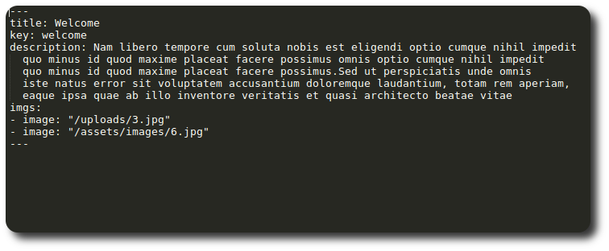
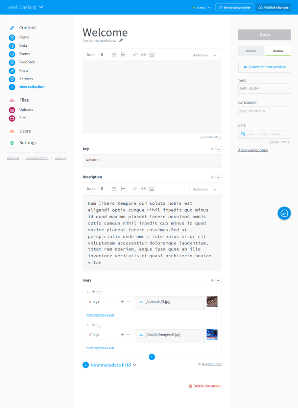
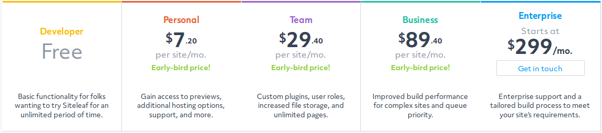

# Jekyll + SiteLeaf \[no-terminado\]
 
[Jekyll es un generador de sitios web estáticos simple, flexible y confiable](https://jekyllrb.com/) desarrollado como una alternativa al uso de complejos e inseguros CMSs dinámicos (como *Drupal*, *WordPress*, etc). Con *Jekyll* podemos evitar el uso de bases de datos, desarrollar sitios altamente personalizables y si sumamos el uso de [GitHub Pages](https://pages.github.com/) a nuestro stack de desarollo, obtenemos además **control de versiones** y **hosting gratis**.

La simplicidad de *Jekyll* viene a expensas de algunas de las características de los CMSs dinámicos, como por ejemplo, una interfaz web amigable para que nuestros clientes actualicen y mantengan el contenido del sitio. Teniendo esto en cuenta, nace [Prose.io](http://prose.io/), un editor web de archivos markdown alojados en *GitHub*. *Prose.io* facilita a los creadores de contenido la publicación/edición en *GitHub*, más **no es lo suficientemente amigable para aquellos clientes con poca experticia tecnológica**.  

Actualmente, existen varios CMSs en el mercado desarrollados específicamente para solucionar el problema antes planteado. Uno de ellos es [SiteLeaf](https://www.siteleaf.com/), un CMS completamente compatible con *Jekyll* con considerables ventajas tanto para el desarrollo como la edición, que valen la pena analizar.

### Ventajas de SiteLeaf desde la perspectiva del 'Desarrollo': 

* Integración con **GitHub** (Todos los cambios hechos en *SiteLeaf* se sincronizan con el repositorio del proyecto).
* Soporte de **Saas** y **CoffeeScript**.
* Acceso a los datos vía **API**.
* Publicación en **Amazon S3**, **Rackspace**, **GitHub Pages** o **FTP**. 

### Ventajas de SiteLeaf desde la perspectiva de la 'Edición de contenido':

* Vista previa de los cambios antes de publicar.
* Adición de imágenes y archivos de texto vía **Drag-and-Drop**.
* Editor de archivos markdown.
* Roles de usuarios (**Admin**, **Publisher**, **Writer**).

## Consideraciones para el uso de SiteLeaf

Es necesario tener presente algunas consideraciones a la hora de adaptar un sitio desarrollado con *Jekyll* para que su contenido sea gestionado con *SiteLeaf*:

### Archivos de datos

El editor de texto de *SiteLeaf* reconoce únicamente archivos en formato **markdown**. En consecuencia, aquellos **archivos de datos (yaml, csv, json) contenidos en el directorio \_data NO pueden ser editados con SiteLeaf**. Incluso, el directorio \_data ni siquiera aparece en el dashboard!

**Solución**: se puede simular la funcionalidad del directorio \_data creando una *colección* con un nombre similar (ej. *datafiles*) y almacenando allí los archivos de datos pero en formato **markdown** encerrando sus contenidos dentro del **Front Matter**. De esta forma nuestros archivos de datos solo contendrán **metadata** que puede ser editada desde *SiteLeaf*.

#### Archivo de datos 'welcome.markdown'

#### Archivo de datos 'welcome.markdown' en el editor de SiteLeaf \[click en la imagen para agrandar\]

### Planes

*SiteLeaf* ofrece cinco planes:

#### Developer \[Gratis\] 

* Sincronización y publicación en **repositorios públicos** de *GitHub*. 
* Soporte únicamente de plugins **whitelisted** (aprobados por *GitHub*) de Jekyll.
* Ilimitados colaboradores. 
* 100 páginas máximo (incluyendo posts y documentos).
* 100MB de almacenamiento.

#### Personal \[$7.20 por sitio | mensual\]

* Sincronización y publicación en **repositorios públicos y privados** de *GitHub*.
* Publicación en **Amazon S3**, **Rackspace** y vía **FTP**.
* Vista previa online del sitio antes de publicar.
* Soporte de plugins basados en *Ruby gems*. 
* 500 páginas máximo (incluyendo posts y documentos).
* 500MB de almacenamiento.
* Soporte técnico por correo electrónico.

#### Team \[$29.40 por sitio | mensual\]

* Soporte de roles de usuario (**Admin**, **Publisher**, **Writer**).
* Páginas ilimitadas. 
* 1GB de almacenamiento.

#### Business \[$89.40 por sitio | mensual\]

* Optimización de tiempo de construcción para sitios grandes. 
* Mayor prioridad de publicación.
* Mayor prioridad de soporte técnico.   

#### Enterprise \[$299 mensual\]

* Proceso de construcción hecho a la medida. 
* Para obtener mayor información sobre este plan se debe contactar directamente con atención al cliente. 

**Importante!** Los precios actuales (01/11/2017) presentan un descuento por motivo de la celebración del lanzamiento de la segunda versión de SiteLeaf.

### Roles de Usuario

<próximamente>

### Demos

<próximamente>

## Conclusiones

<próximamente>

