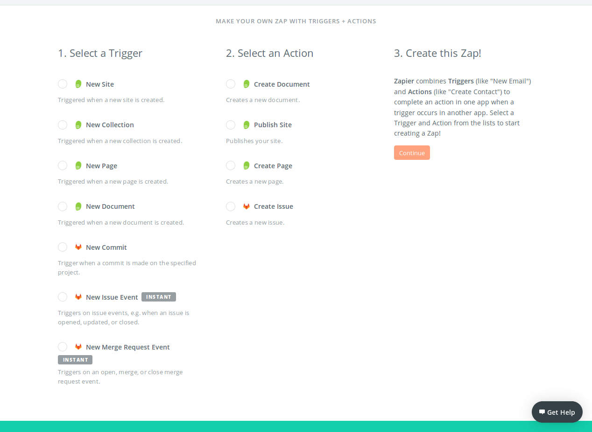

# Integración SiteLeaf + GitLab usando Zapier

## ¿Qué es Zapier?

**Zapier** es una herramienta que permite integrar apps para automatizar tareas. *Zapier* posee 750+ integraciones prefabricadas listas para usar llamadas **Zaps**.  
Los *Zaps* son conexiones entre dos apps que automatizan tareas específicas, como por ejemplo, existe un *Zap* entre *GitLab* y *Twitter* que automáticamente publica un *tweet* cada vez que se realiza un *commit* en un repositorio de *GitLab*.

## ¿Cómo se crea un Zap?

*Zapier* ofrece la opción de crear *Zaps* en caso de que no exista uno que conecte las aplicaciones que queremos o realice las tareas que deseamos automatizar.

Para crear un *Zap* es necesario enlazar un **Disparador** con una o más **Acciones**. 
Por ejemplo, podríamos crear el *Zap* **GitLab + Twitter** siguiente: 

**Disparador**: Cierre de un *issue* en un repositorio *GitLab*. 
**Acción**: Crear un *tweet*. 

El detalle es que **únicamente se pueden utilizar los *disparadores* y las *acciones* disponibles para cada app**  
No se pueden crear *disparadores* ni *acciones*.

## SiteLeaf + GitLab

Para lograr una sincronización entre *GitLab* y *SiteLeaf* deberíamos crear un *Zap* que, como mínimo, se **dispare** cuando un *publicador* edite un sitio en *SiteLeaf* y que la **acción** sea realizar el commit en *GitLab*.

Actualmente **(09/11/2017)**: 

* No existe ningún *Zap* **GitLab + SiteLeaf** que realice esta automatización.

* Zapier tampoco provee los **disparadores** y **acciones** necesarios que permitan la creación del *Zap* que se requiere. 

### Disparadores y Acciones disponibles para GitLab y SiteLeaf

En la siguiente imagen se listan **TODOS** los *disparadores* y *acciones* disponibles tanto para *SiteLeaf* como para *GitLab* en *Zapier*.

 

Referencia: [Zapier: SiteLeaf + GitLab](https://zapier.com/zapbook/siteleaf/gitlab/)

 #
 
 **PD:** con **BitBucket** ocurre lo mismo.  
